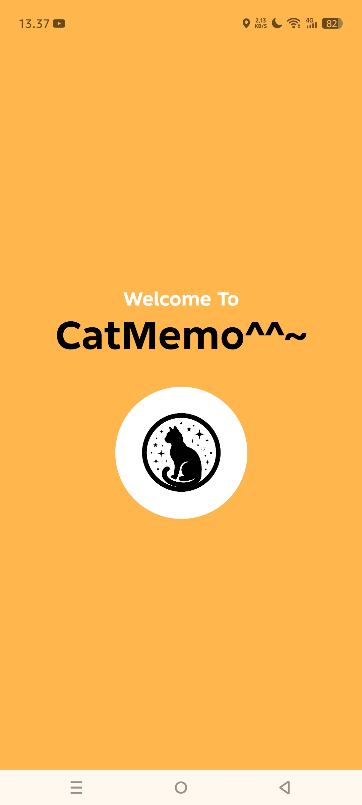

# CatMemo - Smart Notepad with AI Assistant 🐾
Project Pemrograman Mobile - Muhammad Naufal Fariz Akbar (312410048)

Aplikasi notepad dengan tema visual kucing yang dilengkapi dengan sistem autentikasi, manajemen catatan yang rapi, dan fitur asisten AI untuk meringkas tulisan pengguna.

## 📱 User Interface (UI) Documentation

### 1. Autentikasi Pengguna
Halaman awal dan proses pendaftaran/masuk akun.
| Entrance | Login Screen | Sign Up Screen |
|:---:|:---:|:---:|
|  |  |  |

---

### 2. Manajemen Catatan (Notes)
Alur pembuatan catatan baru hingga tampilan daftar utama.
| Home Screen | Dialog Tambah Note | Hasil Setelah Simpan |
|:---:|:---:|:---:|
|  |  |  |

---

### 3. Fitur Editor & Fitur Unggulan
Proses mengedit teks dengan formatting dan penggunaan fitur Pin serta Pencarian.
| Editor Note (Rich Text) | Fitur Pin Note | Fitur Pencarian |
|:---:|:---:|:---:|
|  |  |  |

---

### 4. ✨ Asisten AI (Fitur Utama)
Integrasi AI yang dapat meringkas dan membuat kesimpulan dari catatan pengguna dengan cara komunikasi yang unik, dan lucu, serta beragam. Namun bahasa nya masih dapat diterima dan dipahami dengan cukup baik oleh setiap pengguna. (Dibawah ini adalah contoh dari bagaimana AI CatMemo bekerja. Meski reaksi dari AI nya berbeda-beda, namun inti dari kesimpulan dan ringkasan serta poin-poin pada note tetap sama. Sesuai dengan apa yang memang terisi di dalam note nya).
| Interaksi AI 1 | Interaksi AI 2 |
|:---:|:---:|
|  |  |

---

### 5. Pengaturan Profil
Halaman untuk mengubah informasi pengguna dan preferensi bahasa.
| Profile Screen |
|:---:|
|  |

---

## 🛠️ Fitur Utama:
*   **AI Summary:** Meringkas catatan panjang secara otomatis menggunakan AI.
*   **Rich Text Editor:** Dukungan Bold, Italic, Underline, dan Alignment.
*   **Pin System:** Menyematkan catatan penting di bagian paling atas.
*   **Search Engine:** Mencari catatan dengan highlight kata kunci secara real-time.
*   **User Profile:** Kustomisasi data diri dan pilihan bahasa (Indo/English).
